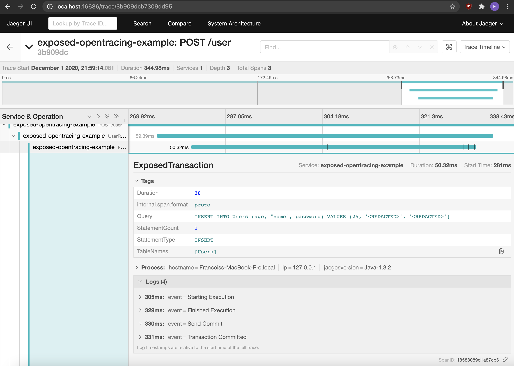

## Earthquake API 

Example application using [Exposed](https://github.com/JetBrains/Exposed) instrumented with OpenTracing using [Exposed-OpenTracing](https://github.com/fstien/Exposed-OpenTracing). Contains a simple user database.
### Running

1. Start an [all-in-one Jaeger backend](https://www.jaegertracing.io/docs/1.20/getting-started/) with in-memory storage.

        docker run -d --name jaeger \
          -e COLLECTOR_ZIPKIN_HTTP_PORT=9411 \
          -p 5775:5775/udp \
          -p 6831:6831/udp \
          -p 6832:6832/udp \
          -p 5778:5778 \
          -p 16686:16686 \
          -p 14268:14268 \
          -p 14250:14250 \
          -p 9411:9411 \
          jaegertracing/all-in-one:1.20
             
2. Start the application.

        ./gradlew run
        
3. Send some requests.

        $curl --location --request POST 'http://localhost:8080/user' \
            --header 'Content-Type: application/json' \
            --data-raw '{
              "username" : "el_franfran",
              "age" : 25,
              "password" : "DJK2LKJnnl2jnn!1234"
            }'
            
  
        $curl localhost:8080/user/el_franfran 
        {
          "username" : "el_franfran",
          "age" : 25,
          "password" : "DJK2LKJnnl2jnn!1234"
        }
        
4. See traces in Jaeger.

    http://localhost:16686/




5. Stop the Jaeger docker container.

        docker ps
        docker stop <containerId>

### Steps

1. Import [Exposed-OpenTracing](https://github.com/fstien/Exposed-OpenTracing) [(commit)](https://github.com/fstien/Exposed-OpenTracing-example/commit/4b70901bcb0a7c8ca695627cd7b22b6f967aa4c9).
    
    ```groovy
    implementation "com.github.fstien:exposed-opentracing:0.1.1"
    ```

2. Instantiate a tracer and register it in [GlobalTracer](https://opentracing.io/guides/java/tracers/) [(commit)](https://github.com/fstien/Exposed-OpenTracing-example/commit/11a1014874748a496bd5af900cc6cdcafd8b150a).

    ```kotlin
    val tracer = Configuration("tracing-example")
        .withSampler(Configuration.SamplerConfiguration.fromEnv()
            .withType(ConstSampler.TYPE)
            .withParam(1))
        .withReporter(Configuration.ReporterConfiguration.fromEnv()
            .withLogSpans(true)
            .withSender(
                Configuration.SenderConfiguration()
                    .withAgentHost("localhost")
                    .withAgentPort(6831))).tracerBuilder
        .withScopeManager(ThreadContextElementScopeManager())
        .build()
    
    GlobalTracer.registerIfAbsent(tracer)
    ```

3. Connect to an in-memory [H2 database](https://github.com/h2database/h2database) and create a Users table [(commit)](https://github.com/fstien/Exposed-OpenTracing-example/commit/247665f1496f89a513b5213e57f78a3ff89d75de).

    ```kotlin
    init {
        Database.connect("jdbc:h2:mem:test;DB_CLOSE_DELAY=-1;", driver = "org.h2.Driver")

        tracedTransaction(contains = NoPII) {
            SchemaUtils.create(Users)
        }
    }
    ```
    
4. Replace calls to `transaction` with `tracedTransaction` [(commit)](https://github.com/fstien/Exposed-OpenTracing-example/commit/0e36218d075bf2f1445d9d0d5acadb6929361a46).
   
   ```kotlin
    tracedTransaction(contains = PII, user.username, user.password) {
    ```