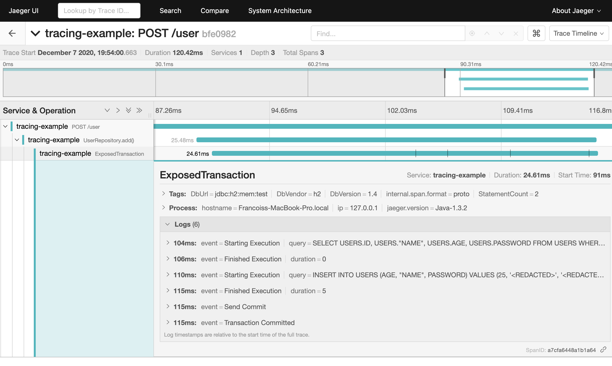

## Earthquake API 

Example application using [Exposed](https://github.com/JetBrains/Exposed) instrumented with OpenTracing using [Exposed-OpenTracing](https://github.com/fstien/Exposed-OpenTracing). Contains a simple user database.
### Running

1. Start an [all-in-one Jaeger backend](https://www.jaegertracing.io/docs/1.20/getting-started/) with in-memory storage.

        docker run -d --name jaeger \
          -e COLLECTOR_ZIPKIN_HTTP_PORT=9411 \
          -p 5775:5775/udp \
          -p 6831:6831/udp \
          -p 6832:6832/udp \
          -p 5778:5778 \
          -p 16686:16686 \
          -p 14268:14268 \
          -p 14250:14250 \
          -p 9411:9411 \
          jaegertracing/all-in-one:1.20
             
2. Start the application.

        ./gradlew run
        
3. Send some requests.

        $curl --location --request POST 'http://localhost:8080/user' \
            --header 'Content-Type: application/json' \
            --data-raw '{
              "username" : "el_franfran",
              "age" : 25,
              "password" : "DJK2LKJnnl2jnn!1234"
            }'
            
  
        $curl localhost:8080/user/el_franfran 
        {
          "username" : "el_franfran",
          "age" : 25,
          "password" : "DJK2LKJnnl2jnn!1234"
        }
        
4. See traces in Jaeger.

    http://localhost:16686/

5. Stop the Jaeger docker container.

        docker ps
        docker stop <containerId>

### Steps

